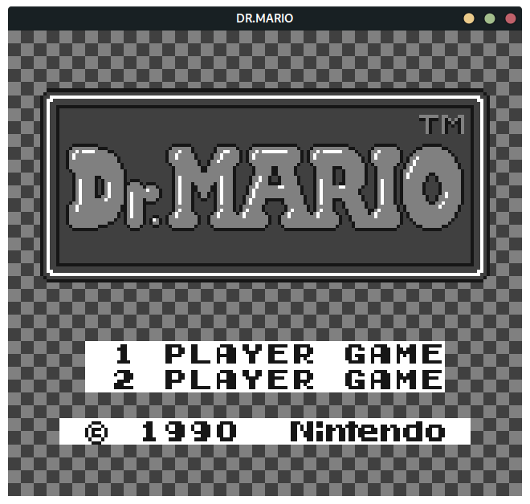
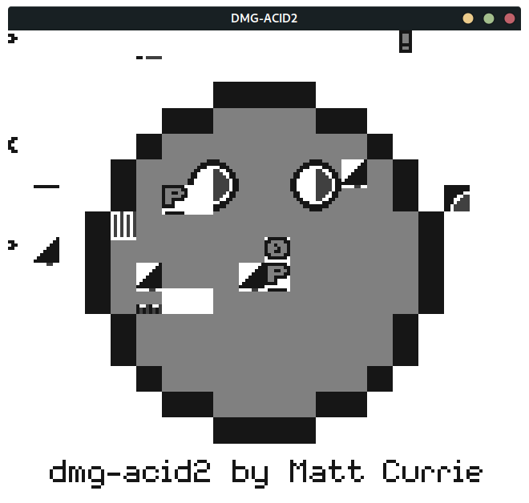

# Zig GB Emu

Gameboy (DMG) emulator written in Zig.

## Build instructions

Provide the needed ROMs listed in `src/roms/required.txt`,
update the submodules and build using `zig build`.

## Currently unimplemented

- MBCs
- Some sprite drawing features
- Timers
- Joypad
- Sound
